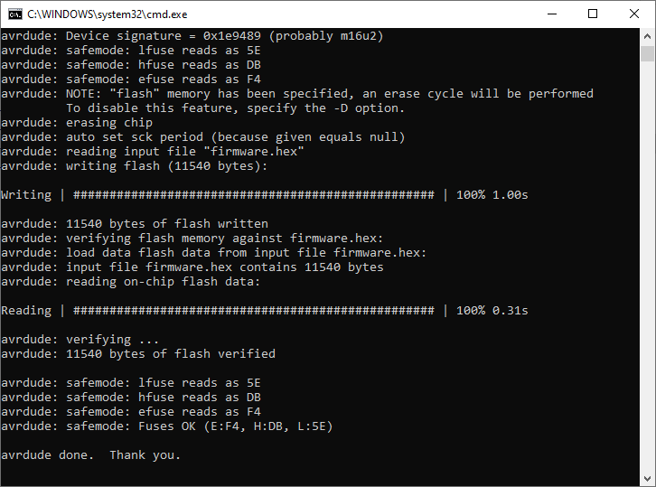

# Readme

This upgrades the `m0110_usb` with qmk/via/vial support.

## Instructions:

### Place adapter in bootloader mode:

You need to put the adapter in to bootloader mode so you can upgrade or flash
the firmware. With your keyboard connected to the adapter and plugged in to your
PC, press Shift + Option + ⌘ + B on your M0110 keyboard.

### Windows 10/11:

#### Step 1: Download QMK firmware and tools for your adapter

- Download
  [needed files](https://github.com/tinkerBOY-git/tinkerBOY/raw/main/converter/m0110_usb/m0110_upgrade_tools.zip)
  for tinkerBOY M0110 Adapter

Create a new folder and extract the zip file in to it. It should contain 4
files.

#### Step 2: Flash the firmware

Go to the folder you extracted the zip file to and double click run.bat. Press
any key to flash the new firmware. When you’re done you should see something
like the screenshot below:

### macOS:

#### Requirements:

- [Homebrew](https://brew.sh/)
- [avrdude Brew formulae](https://formulae.brew.sh/formula/avrdude)

#### commands:

0. Open preferred terminal application. `Terminal`, `Kitty`, `Wezterm`, etc.
1. `brew install avrdude`
2. `git clone git@github.com:tinkerBOY-git/tinkerBOY.git tinkerboy`
3. `cd tinkerboy/converter/m0110_usb`
4. `unzip m0110_upgrade_tools.zip`
5. `./run.sh`

## Information:

See this post by tinkerBOY:
[QMK Firmware: Remapping and configuring your keyboard with Via or Vial](https://www.tinkerboy.xyz/qmk-firmware-remapping-and-configuring-your-keyboard-with-via-or-vial/).

# Based on:

[Upgrading the tinkerBOY ADB / M0110 adapter to support QMK Firmware with VIA support](https://www.tinkerboy.xyz/upgrading-the-tinkerboy-adb-m0110-adapter-to-support-qmk-firmware-with-via-support/).
